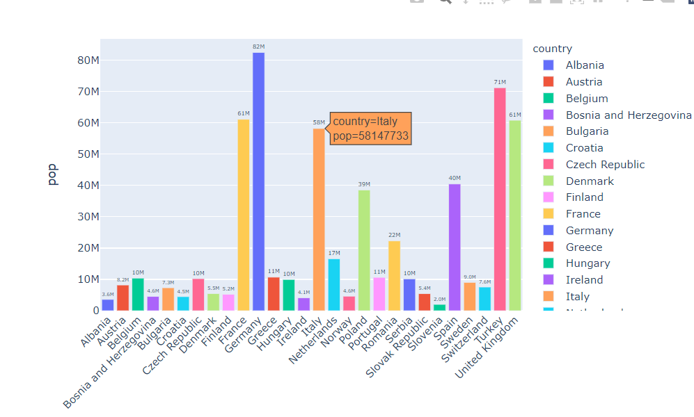
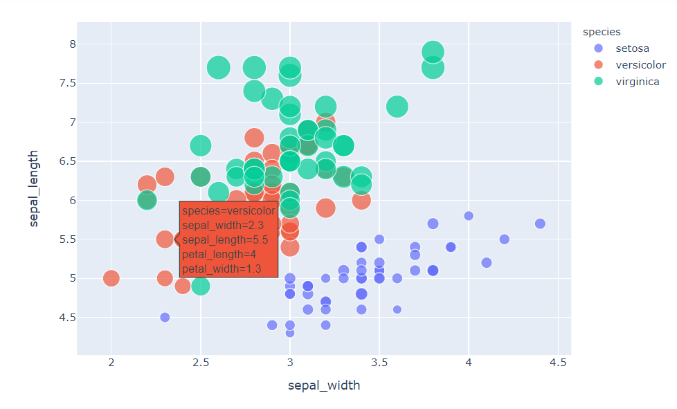
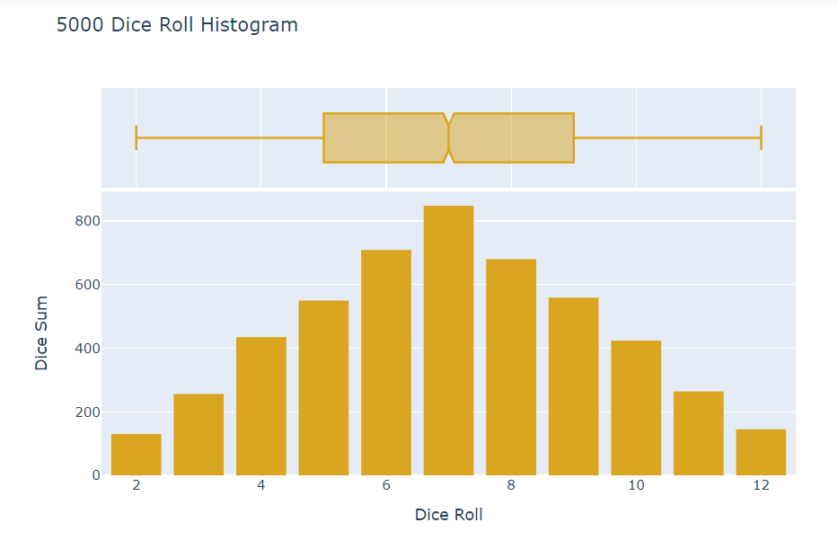
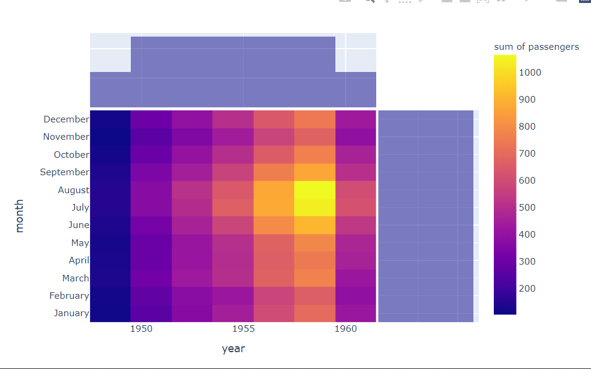
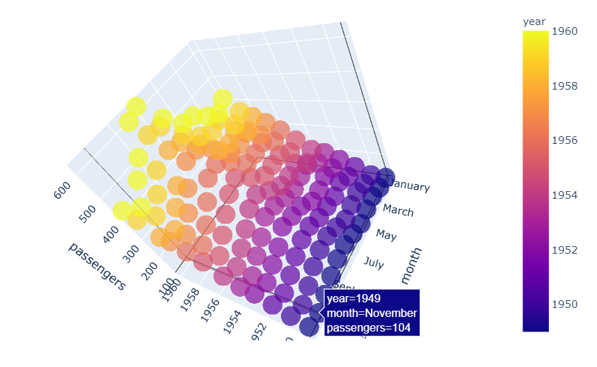
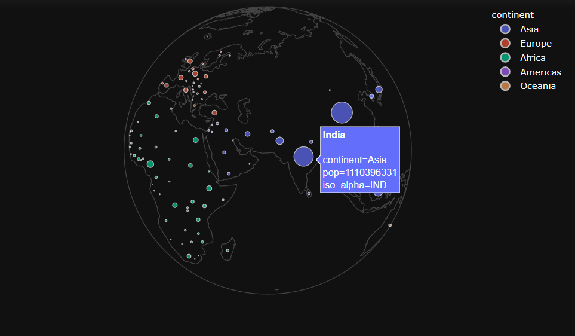
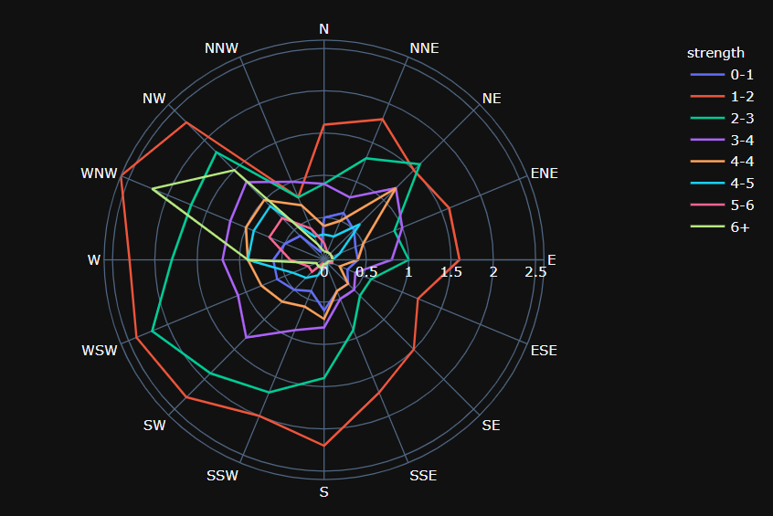

# About this repository

**Learn-plotly** was created to have a personnel repo for referring syntax of a famous graph plotting library in python **Plotly**.   

#  What to do with this repo

Clone this repository in your local system by  
<code> git clone https://github.com/AdityaKumar-01/learn-plotly.git</code>   _or_ **download zip file**.
  

# Some interesting graph in this repo
### Line Plot 
 
### Scatter Plot
 
### Histogram
 
### Heatmap
 
### 3D Scatter
 
### Globe Representation
 
### Polar Chart
 
 
# Required Library

<ul>
	<li>Plotly</li>
	<li>Cufflinks</li>
	<li>Seaborn</li>
	<li>Numpy</li>
	<li>Pandas</li>
</ul>
  
